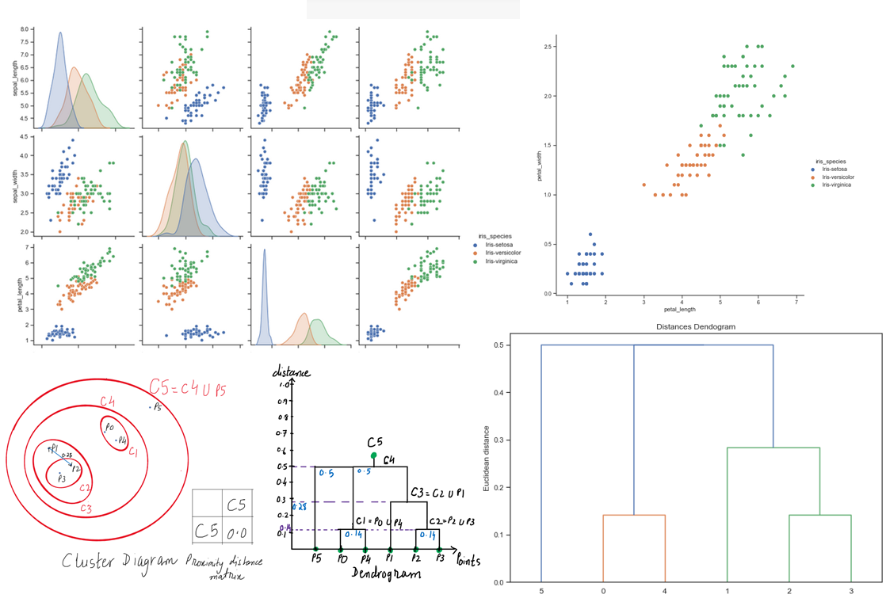
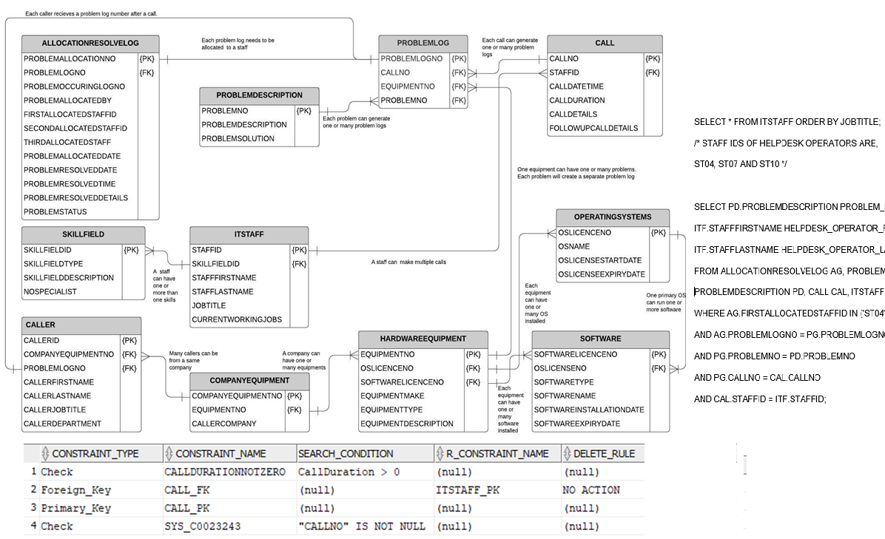
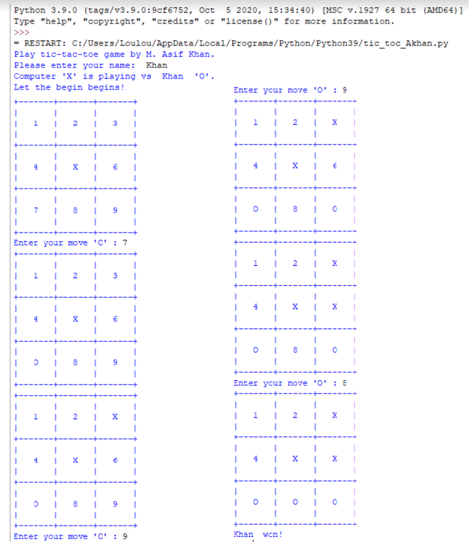
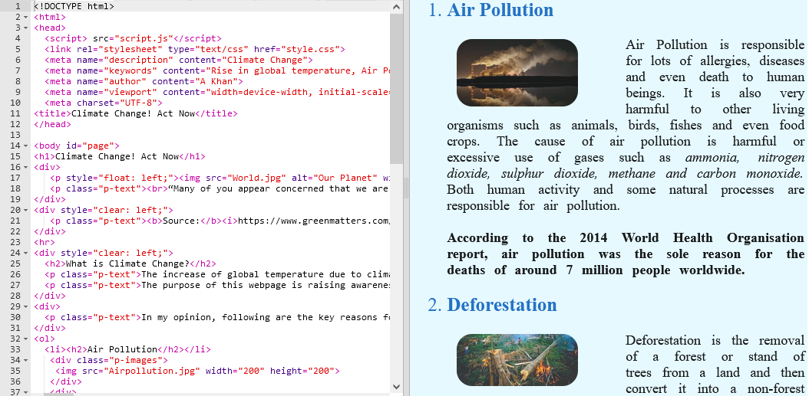

# Portfolio

---
## Applied Machine Learning Project in MATLAB

### Using Machine Learning techniques to understand what are the reasons which can affect the heart attack

Please press the link below to see the details. 

**Summary:** I used MATLAB programming environment to build and train various classification models by using the given data. In the first stage, I used pre-processing to fill the missing data and check for outliers. In the second stage, data normalisation was carried out. In the stage three, I used feature selections to focus on those data features that are most likely to produce accurate results by using the Parallel Coordinates Plot. In the stage four, I used three ML classification techniques called Decision Tree, SVM, and KNN to build and train models to solve the given problem. I also evaluated each model's performance by using percentage accuracy, prediction speed, training time, and AUC. In the last stage, I used performance matrix to comapre three models and used optimisation to select the best model.
  

---

## Exploratory Data Analysis in Python 

### To Predict a species of a flower based on its characterstics by using Clustering  

Please press the link below to see the details.

**Summary:** I used Fisher's Iris data set and used Anaconda Python jupyter notebook for coding. First, I converted the given csv file into a dataframe by using pandas. Then, I checked for missing values and dropped all NaN and NA values. I used pandas again to get meaningful statistics and showed statistical significance by using the pairplot with the help of seaborn library. Scatter diagram was also drawn by using matplotlib library. Finally, I used an unsupervised Machine Learning technique called Agglomerative Hierarchical clustering and implement it's algorithms in Python. I also used the Euclidean distance, and single linkage (minimum distance between any two points) to cluster the given data points by using Dendrogram. 

---

## Database Management by using Oracle SQL 

### Database Designing, Implementating and Testing of a Database   

Please press the link below to see the details.

**Summary:** In this project, I designed a conceptual data model to represent the data requirements of the Help Desk scenario. In my model, I used the Entity Relationship (E-R) diagram to list the attributes of each entity and explain the relationship between various entities. I also discussed the assumptions I made during the design phase. By using the conceptual model, I developed a relational schema consisting of the definitions of the domains and relations that represent the entity and relationship types, including primary keys, foreign keys and any constraints. I used my database design to implement the Help Desk database using Oracle SQL DBMS. I used SQL DDL statements to create tables, insert data and queries to provide the required functionality. Finally, I used SQL DML statements to test the database by answering the selected questions designed by the database administrator. 

---

## Game Programming in Python  

### Tic-Toc-Game     

Please press the link below to see the details.

**Summary:** This is the project I did at the end of the PCEP (Python Certified Entry-Level Programmer certification). This certification is a professional credential that measures your ability to accomplish coding tasks related to the essentials of programming in the Python language. In this project, I used various programming concepts like selection, iteration and using data types. I have demonstrated a solid understanding of resolving typical implementation challenges with the help of the Python Standard Library

---

## Designing a website by using HTML, CSS and JavaScript

### Climate Change! Act Now 

Please press the link below to view my website. 

[ Climate Change! Act Now ](https://akhan-5165.trinket.io/sites/climatechange)

**Summary:** This project was to develop a website by using HTML, CSS and JavaScript during the course called ‘Introduction to Web Development’ by Raspberry Foundation. In the first stage, I used HTML to lay out the webpages. Then I used clear CSS to style elements of the webpages consistently. Finally, I used JavaScript commands to make the quiz page more engaging for visitors. 

---
